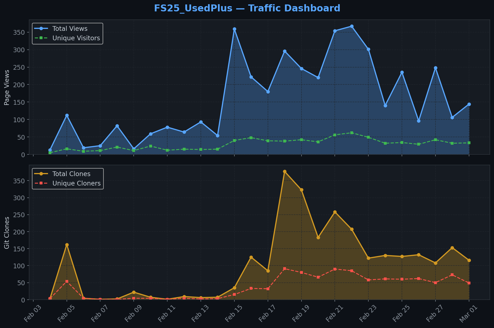
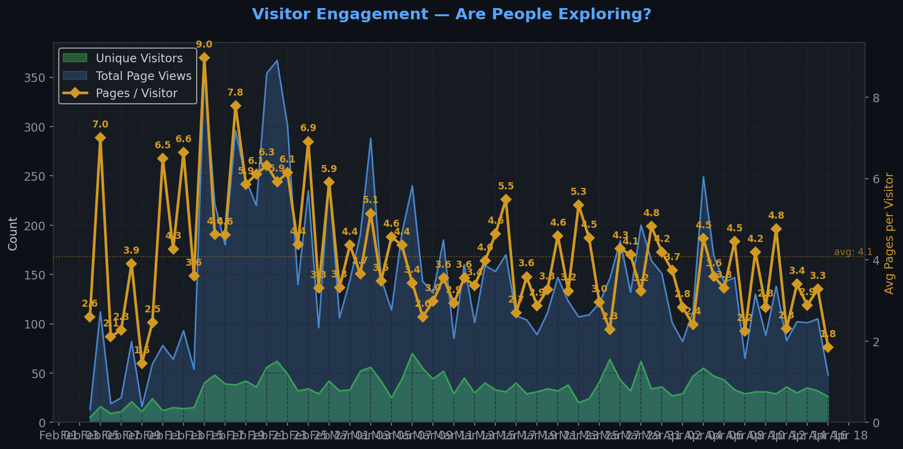
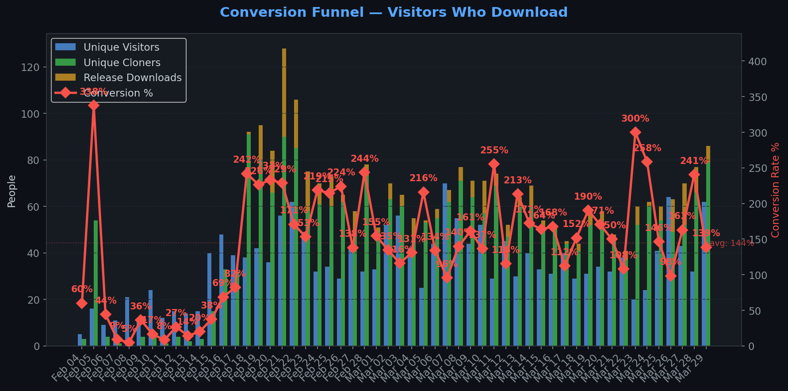
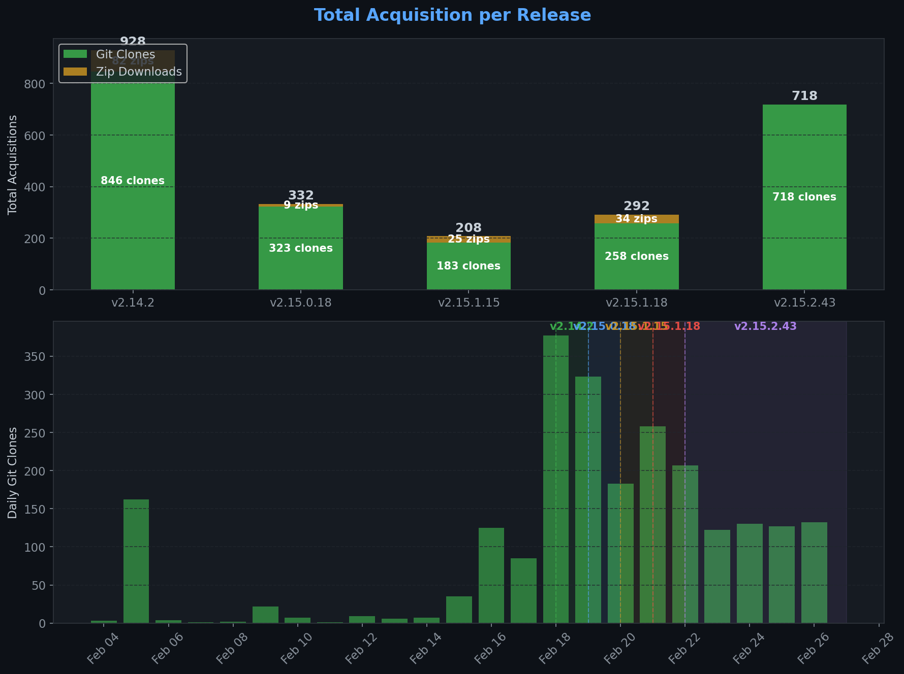
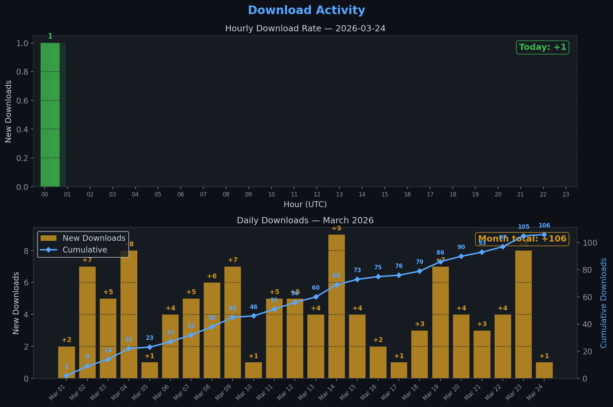
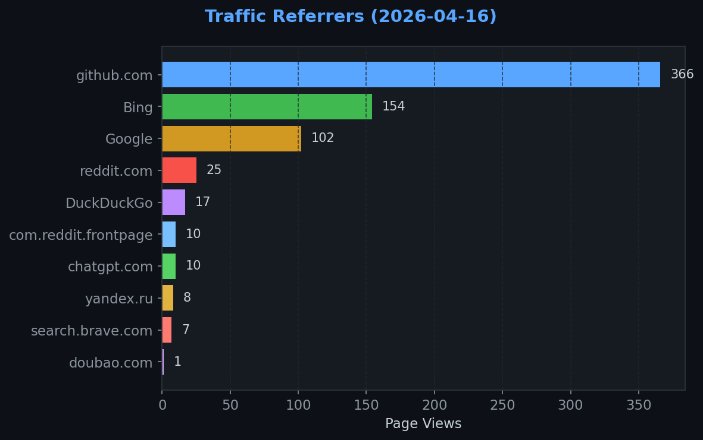
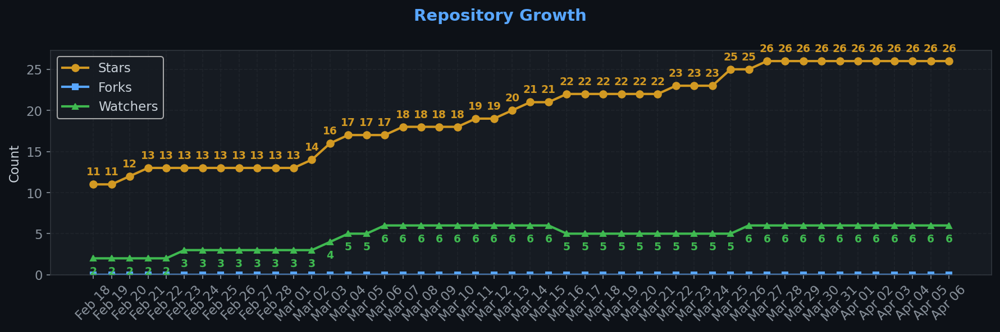

# FS25_UsedPlus — Traffic Dashboard

**Last updated:** 2026-03-24T12:14:52Z
**Days tracked:** 35 | **Download snapshots:** 798 (hourly)

---

## Views & Clones (14-day window, preserved forever)

| Metric | 14-Day Total | Unique |
|--------|-------------|--------|
| Page Views | 1826 | 247 |
| Git Clones | 2045 | 639 |

> **Engagement:** 7.3 pages per visitor (14-day avg)

---

## Visitor Engagement

> Higher = visitors exploring more pages. 1.0 = bounce. 3.0+ = deeply engaged.

---

## Conversion Funnel

> **14-day conversion:** 816 of 247 visitors cloned or downloaded (**330.3%**)
>
> Unique cloners: 639 | Release downloads: 177

---

## Total Acquisition per Release (Downloads + Clones)

| Channel | Count |
|---------|-------|
| Zip Downloads | 177 |
| Git Clones (14-day) | 2045 |
| **Total Acquisitions** | **2222** |

---

## Download Activity

> **Top:** Hourly download rate for the most recent day with activity. **Bottom:** Daily downloads within the current month with cumulative trend line.

---

## Referrers

| Source | Views | Unique |
|--------|-------|--------|
| github.com | 639 | 121 |
| Bing | 78 | 15 |
| Google | 70 | 16 |
| Yahoo | 24 | 1 |
| qwant.com | 4 | 1 |
| search.brave.com | 2 | 1 |
| DuckDuckGo | 1 | 1 |
| reddit.com | 1 | 1 |

---

## Repository Growth

| Metric | Current |
|--------|---------|
| Stars | 23 |
| Forks | 0 |
| Watchers | 5 |

---

## Top Pages (14-day)

| Page | Views | Unique |
|------|-------|--------|
| `/XelaNull/FS25_UsedPlus` | 653 | 178 |
| `/XelaNull/FS25_UsedPlus/issues` | 159 | 50 |
| `/XelaNull/FS25_UsedPlus/releases` | 145 | 58 |
| `/XelaNull/FS25_UsedPlus/releases/tag/v2.14.2` | 66 | 37 |
| `/XelaNull/FS25_UsedPlus/issues/36` | 55 | 17 |
| `/XelaNull/FS25_UsedPlus/releases/tag/v2.15.4.22` | 45 | 28 |
| `/XelaNull/FS25_UsedPlus/issues/40` | 45 | 12 |
| `/XelaNull/FS25_UsedPlus/wiki` | 26 | 13 |
| `/XelaNull/FS25_UsedPlus/tree/master` | 23 | 8 |
| `/XelaNull/FS25_UsedPlus/issues/43` | 22 | 11 |

---

## Data Files

| File | Description | Granularity |
|------|-------------|-------------|
| [daily.json](daily.json) | Views & clones per day (never expires) | Daily |
| [downloads.json](downloads.json) | Release download snapshots | Hourly |
| [referrers.json](referrers.json) | Referrer snapshots | Daily |
| [metadata.json](metadata.json) | Stars, forks, watchers | Daily |
| [stats.json](stats.json) | Combined legacy snapshots | 6-hourly |

---
*Hourly download tracking + full dashboard with engagement metrics every 6 hours*
*Auto-generated by [traffic-stats.yml](../../.github/workflows/traffic-stats.yml)*
