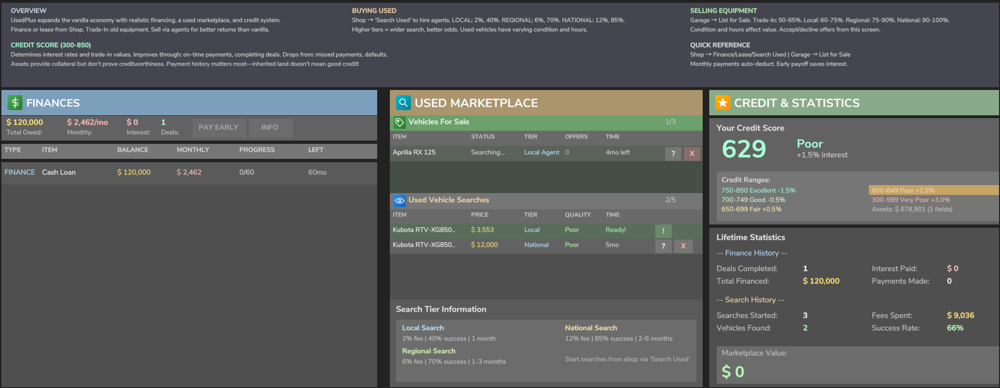

<p align="center">
  
</p>

<h1 align="center">UsedPlus</h1>

<p align="center">
  <strong>Transform Your Farm Into a Real Business</strong><br>
  <em>Stop playing with Monopoly money. Start making real financial decisions.</em>
</p>

<p align="center">
  
  
  
  
  
  
</p>

<p align="center">
  <a href="https://github.com/XelaNull/FS25_UsedPlus/wiki">📚 Wiki</a> •
  <a href="https://github.com/XelaNull/FS25_UsedPlus/wiki/Installation">📥 Installation</a> •
  <a href="https://github.com/XelaNull/FS25_UsedPlus/wiki/Quick-Start-Guide">🚀 Quick Start</a> •
  <a href="https://github.com/XelaNull/FS25_UsedPlus/issues">🐛 Report Issues</a> •
  <a href="https://github.com/XelaNull/FS25_UsedPlus/blob/master/CHANGELOG.md">📝 Changelog</a> •
  <a href="https://github.com/XelaNull/FS25_UsedPlus/blob/master/docs/TRAFFIC_DASHBOARD.md">📊 Live Metrics</a>
</p>

---

<p align="center">
  
</p>

<p align="center">
  <strong>🎯 Your Financial Command Center</strong><br>
  <sub><em>Manage loans, leases, credit score, used vehicle searches, and vehicle sales—all in one unified interface</em></sub>
</p>

<p align="center">
  📸 <a href="https://github.com/XelaNull/FS25_UsedPlus/wiki/Gallery"><strong>View Full Screenshot Gallery (23 images)</strong></a> •
  📚 <a href="https://github.com/XelaNull/FS25_UsedPlus/wiki"><strong>Explore the Wiki</strong></a>
</p>

---

> ## ⚠️ DEVELOPMENT PREVIEW — THIS MOD IS NOT FINISHED
>
> **This is an active work-in-progress.** You are welcome to download and try it, but expect bugs, incomplete features, and breaking changes between versions. **Do not treat this as a stable release.**
>
> **What works:** Vehicle financing, building financing, leasing, credit scoring, used marketplace, trade-ins, land financing, OBD Scanner.
>
> **What's still in progress:** Malfunctions system, Service Truck restoration, multiplayer edge cases, balance tuning.
>
> **Download latest:** [github.com/XelaNull/FS25_UsedPlus/releases](https://github.com/XelaNull/FS25_UsedPlus/releases) — **Report issues:** [github.com/XelaNull/FS25_UsedPlus/issues](https://github.com/XelaNull/FS25_UsedPlus/issues)

---

## What Is UsedPlus?

UsedPlus transforms Farming Simulator 25 into a **real business simulation**. Your farm runs on credit, reputation, and strategic financial decisions—just like actual farming.

**The core philosophy:** Give players meaningful choices with real consequences. Finance a tractor over 10 years or save up cash. Buy new or search for used. Lease seasonal equipment or own it outright. Finance buildings and infrastructure, not just vehicles. Every path has tradeoffs. Every decision shapes your farm's future.

**In vanilla FS25:**
Money in, money out. Click buy. Equipment appears. Sell for recycled value. Repeat.

**With UsedPlus:**
- Finance vehicles AND buildings over 1-15 years, land over 1-20 years—but watch your credit score or rates skyrocket
- Buy used equipment from AI sellers who remember if you lowballed them last time
- Inspect before you buy—is it a reliable workhorse or a lemon waiting to break?
- Negotiate deals when weather tanks prices, or overpay when you're desperate
- Build equity in financed buildings, manage lease terms, secure cash loans with collateral

Your financial decisions compound. Miss payments, lose equipment. Build credit, unlock better rates. Burn a seller relationship, lose access to their inventory. The economy remembers.

---

## 🎯 Core Features

<table>
<tr>
<td align="center" width="33%">
<br>
<strong><a href="https://github.com/XelaNull/FS25_UsedPlus/wiki/Credit-Scoring">Credit Scoring</a></strong><br>
<sub>300-850 FICO-style score gates rates and terms</sub>
</td>
<td align="center" width="33%">
<br>
<strong><a href="https://github.com/XelaNull/FS25_UsedPlus/wiki/Vehicle-Financing">Vehicle Financing</a></strong><br>
<sub>1-15 year terms, credit-based rates</sub>
</td>
<td align="center" width="33%">
<br>
<strong><a href="https://github.com/XelaNull/FS25_UsedPlus/wiki/Used-Marketplace">Used Marketplace</a></strong><br>
<sub>Agent-based buying & selling</sub>
</td>
</tr>
<tr>
<td align="center" width="33%">
<br>
<strong><a href="https://github.com/XelaNull/FS25_UsedPlus/wiki/Negotiation-System">Price Negotiation</a></strong><br>
<sub>Weather affects outcomes, lowball = permanent walk-away</sub>
</td>
<td align="center" width="33%">
<br>
<strong><a href="https://github.com/XelaNull/FS25_UsedPlus/wiki/Vehicle-DNA">Vehicle DNA</a></strong><br>
<sub>Lemons, workhorses, legendaries - every vehicle unique</sub>
</td>
<td align="center" width="33%">
<br>
<strong><a href="https://github.com/XelaNull/FS25_UsedPlus/wiki/Trade-In-System">Trade-Ins</a></strong><br>
<sub>50-65% instant value for convenience</sub>
</td>
</tr>
<tr>
<td align="center" width="33%">
<br>
<strong><a href="https://github.com/XelaNull/FS25_UsedPlus/wiki/Building-Financing">Building Financing</a></strong><br>
<sub>Finance sheds, silos, and placeables - credit-based rates</sub>
</td>
<td align="center" width="33%">
<br>
<strong><a href="https://github.com/XelaNull/FS25_UsedPlus/wiki/Cash-Loans">Cash Loans</a></strong><br>
<sub>Borrow against collateral for expansion capital</sub>
</td>
<td align="center" width="33%">
<br>
<strong><a href="https://github.com/XelaNull/FS25_UsedPlus/wiki/Vehicle-Leasing">Vehicle Leasing</a></strong><br>
<sub>Seasonal equipment access without ownership</sub>
</td>
</tr>
<tr>
<td align="center" width="33%">
<br>
<strong><a href="https://github.com/XelaNull/FS25_UsedPlus/wiki/OBD-Scanner">OBD Scanner</a></strong><br>
<sub>Field diagnostics, one-time use per system</sub>
</td>
<td align="center" width="33%">
<br>
<strong><a href="https://github.com/XelaNull/FS25_UsedPlus/wiki/Service-Truck">Service Truck</a></strong><br>
<sub>Restore reliability ceiling - must be discovered</sub>
</td>
<td align="center" width="33%">
<br>
<strong><a href="https://github.com/XelaNull/FS25_UsedPlus/wiki/Malfunctions">Malfunctions</a></strong><br>
<sub>15+ failure types from neglected maintenance</sub>
</td>
</tr>
</table>

**📚 [Complete Feature List →](https://github.com/XelaNull/FS25_UsedPlus/wiki)**

---

## 🌟 What Makes This Different

### Everything Connects

| System | Affects |
|--------|---------|
| **Credit Score** | Interest rates, loan terms, lease eligibility, trade-in values |
| **Vehicle DNA** | Long-term reliability, seller personality, repair outcomes, RVB integration |
| **Payment History** | Credit score (+5 per payment, -25 per miss), repossession risk |
| **Weather** | Negotiation success (Hail +12%, Storm +8%, Rain +5%) |
| **Maintenance** | 15+ specific malfunctions, runaway engines, system failures |

**[Learn How Systems Interact →](https://github.com/XelaNull/FS25_UsedPlus/wiki)**

### Your Vehicles Have Stories

Ever find yourself making up backstories for your equipment? With UsedPlus, you don't have to imagine - the stories emerge naturally:

> *"That old Fendt? 80,000 hours and still runs like new. I'll never sell her."*

> *"Got a 'great deal' from a desperate seller. Now I know why he was desperate."*

> *"Waited for a thunderstorm to close the deal. Saved me $40,000."*

> *"The mechanic warned me. Said something about burning sage. I should have listened."*

Every vehicle has hidden DNA. Some become legends. Some become money pits. The mechanic gives you hints, the seller's behavior tells a story, and over hundreds of hours, you'll develop genuine attachment to the machines that earn it.

**[Discover Vehicle DNA →](https://github.com/XelaNull/FS25_UsedPlus/wiki/Vehicle-DNA)**

---

## 🤝 Companion Mods

UsedPlus **deeply integrates** with these mods to create a unified experience:

### 🔧 Real Vehicle Breakdowns (RVB)

**Integration Level: DEEP** — UsedPlus and RVB coordinate to create a layered failure system.

| What RVB Does | How UsedPlus Enhances |
|---------------|----------------------|
| Hard failures (parts break completely) | Symptoms first (misfires, overheating) before RVB hard failure |
| Part-based tracking (starter, generator, etc.) | DNA affects RVB part lifetimes (0.6x-1.4x multiplier) |
| Visual damage | OBD Scanner shows both UsedPlus + RVB health in one view |
| Repair workshops | Partial repair option coordinates with RVB part states |

**Why Use Both:** RVB provides the mechanical depth, UsedPlus provides the economic consequences. Lemons break RVB parts faster. Workhorses extend RVB part life. The OBD Scanner becomes your essential tool showing both systems together.

**[Deep Dive: RVB Integration →](https://github.com/XelaNull/FS25_UsedPlus/wiki/RVB-Integration)**

### 🛞 Use Up Your Tyres (UYT)

**Integration Level: DEEP** — Tire wear, quality, and DNA create emergent long-term strategy.

| What UYT Does | How UsedPlus Enhances |
|---------------|----------------------|
| Tire wear % per wheel (distance based) | DNA affects wear rate (lemons 1.4x, workhorses 0.6x) |
| Visual deterioration | Quality tier affects UYT wear (Quality tires wear 33% slower) |
| Per-wheel tracking (FL, FR, RL, RR) | Flat tire probability scales with UYT wear % |
| Replacement based on wear | OBD Scanner displays UYT wear with color-coded warnings |

**Why Use Both:** Quality tires on a workhorse = 2,500 hour lifespan. Retread tires on a lemon = 350 hours. The math changes your purchasing decisions. Used vehicles come with realistic tire wear. The OBD Scanner shows you exactly which tires need replacement.

**[Deep Dive: UYT Integration →](https://github.com/XelaNull/FS25_UsedPlus/wiki/UYT-Integration)**

> 💡 **Tip:** Both RVB and UYT are optional but highly recommended. UsedPlus works standalone, but the combination creates the most immersive economic simulation.

---

## 🤖 100% AI-Written

This mod was written **entirely by AI**. Not a single line of code was written by a human - only reviewed.

Every function, every dialog, every network event, every XML layout - all generated by **Claude** (developer) with UX review by **Samantha** (co-creator) through Anthropic's Claude Code.

### Codebase Statistics

- **139,779 lines of code** (63,430 Lua • 71,749 XML • 4,600 JavaScript)
- **350 mod files** (126 Lua • 75 XML • 50 icons • 59 textures • 10 3D models)
- **39 GUI screens** (35 dialogs, 2 frames, 2 panels)
- **10 manager classes** orchestrating game systems
- **13 network event modules** for multiplayer sync
- **11 specialization modules** for maintenance systems
- **14 extension hooks** into base game systems
- **13 utility/helper modules** for shared logic
- **12 development tools** for build, validation & stats
- **1,998 localization keys** translated to 26 languages
- **5 months development** (November 2025 - present)

<details>
<summary><b>📊 Detailed Architecture Breakdown</b></summary>

**Manager Layer** (5,150 lines):
- FinanceManager (1,119) • VehicleSaleManager (1,048) • VehicleSpawning (596) • VehicleSearchSystem (501)

**Network Events** (4,818 lines):
- LeaseEvents (787) • FinanceEvents (701) • UsedMarketEvents (528) • MaintenanceEvents (470)

**Specializations** (5,549 lines):
- UsedPlusMaintenance (1,359) • MaintenanceHydraulics (831) • MaintenanceReliability (805) • MaintenanceConfig (536)

**Extensions** (6,669 lines):
- RVBWorkshopIntegration (1,581) • InGameMenuVehiclesFrameExtension (1,064) • VehicleSellingPointExtension (901) • ShopConfigScreenExtension (664)

**Utilities** (6,785 lines):
- ModCompatibility (1,711) • UsedPlusAPI (854) • UIHelper (756) • UsedPlusUI (647)

**Dialog Categories**:
- Finance System (9) • Marketplace - Buying (7) • Marketplace - Selling (6)
- Maintenance & Repair (7) • Service Truck (2) • Purchase System (3)

</details>

We believe this is one of the most ambitious AI-human collaborative software projects released to the public for FS25.

---

## 📥 Installation

1. **Download** `FS25_UsedPlus.zip` from [**GitHub Releases**](https://github.com/XelaNull/FS25_UsedPlus/releases)
2. **Place** the ZIP (do not extract!) in your mods folder:
   - Windows: `Documents\My Games\FarmingSimulator2025\mods\`
   - Mac: `~/Library/Application Support/FarmingSimulator2025/mods/`
3. **Enable** "UsedPlus" in the mod selection screen
4. **Start** a new game or continue an existing save

> 💡 **Updating?** Remove the old `FS25_UsedPlus.zip` first, then add the new version. Your savegame data (loans, credit score, etc.) will be preserved.

**[Detailed Installation Guide →](https://github.com/XelaNull/FS25_UsedPlus/wiki/Installation)**

---

## 🚀 Quick Start

### Getting Equipment

| Action | How | What It Does |
|--------|-----|--------------|
| **Buy/Finance/Lease** | Shop buy buttons | Opens Unified Purchase Dialog with all options |
| **Search Used** | Press **U** in shop | Find discounted pre-owned equipment (10k+ items) |
| **Trade-In** | Inside purchase dialog | Apply old equipment value toward purchase |

### Managing Your Farm

| Action | Shortcut |
|--------|----------|
| **Finance Manager** | **Esc** → Finance Manager |
| **Repair/Repaint Vehicle** | Click owned vehicle on map |
| **Finance/Lease Land** | Click unowned field on map |

### In the Finance Manager

- View all active deals (vehicles, land, loans)
- Check credit score and payment history
- Make payments (skip, minimum, standard, extra, custom)
- Accept or decline incoming sale offers
- Early payoff with interest savings

**[Complete Quick Start Guide →](https://github.com/XelaNull/FS25_UsedPlus/wiki/Quick-Start-Guide)**

---

## 🌍 Languages

UsedPlus supports **26 languages** with **1,998 translation keys** each:

English (en) • German (de) • French (fr) • French Canadian (fc) • Spanish (es) • Spanish LatAm (ea) • Italian (it) • Portuguese (pt) • Portuguese BR (br) • Polish (pl) • Czech (cz) • Russian (ru) • Ukrainian (uk) • Dutch (nl) • Hungarian (hu) • Turkish (tr) • Japanese (jp) • Korean (kr) • Danish (da) • Indonesian (id) • Norwegian (no) • Romanian (ro) • Swedish (sv) • Vietnamese (vi) • Finnish (fi) • Chinese Traditional (ct)

All translations are AI-generated using Claude. If you notice issues, please [report them](https://github.com/XelaNull/FS25_UsedPlus/issues)!

---

## 🔌 Compatible Mods

UsedPlus **plays nice** with these financial and marketplace mods through feature deferral:

| Mod | How It Works Together |
|-----|----------------------|
| 💰 **[EnhancedLoanSystem](https://www.farming-simulator.com/mod.php?mod_id=314906&title=fs2025)** | ELS handles general cash loans, UsedPlus handles purchase financing. Finance Manager shows both. |
| 📋 **[HirePurchasing](https://www.farming-simulator.com/mod.php?mod_id=327821&title=fs2025)** | HP handles its financing system, UsedPlus hides duplicate buttons. Finance Manager shows HP + UsedPlus leases together. |
| 🛒 **[BuyUsedEquipment](https://www.farming-simulator.com/mod.php?mod_id=312631&title=fs2025)** | BUE handles used marketplace, UsedPlus defers (hides Search button). Use BUE to find, UsedPlus to finance/maintain. |
| 📝 **[Better Contracts](https://www.farming-simulator.com/mod.php?mod_id=312492&title=fs2025)** | BC farmland discounts from completed contracts applied in UsedPlus land purchase dialog. Shows discount amount, percentage, and jobs completed. |

**Integration Strategy:** When UsedPlus detects these mods, it automatically hides overlapping features to prevent conflicts. You get the best of both worlds - use each mod for what it does best.

> 💡 **Tip:** Load order doesn't matter. UsedPlus detects these mods at runtime and adjusts behavior automatically.

**[Full Compatibility Guide →](https://github.com/XelaNull/FS25_UsedPlus/wiki/Other-Mod-Compatibility)**

---

## 📚 Documentation

| Page | What's Inside |
|------|---------------|
| **[Wiki Home](https://github.com/XelaNull/FS25_UsedPlus/wiki)** | Complete documentation hub |
| **[Installation](https://github.com/XelaNull/FS25_UsedPlus/wiki/Installation)** | Step-by-step setup guide |
| **[Quick Start](https://github.com/XelaNull/FS25_UsedPlus/wiki/Quick-Start-Guide)** | Essential controls and workflows |
| **[Credit Scoring](https://github.com/XelaNull/FS25_UsedPlus/wiki/Credit-Scoring)** | How credit affects everything |
| **[Vehicle DNA](https://github.com/XelaNull/FS25_UsedPlus/wiki/Vehicle-DNA)** | Lemons, workhorses, legendaries explained |
| **[Negotiation System](https://github.com/XelaNull/FS25_UsedPlus/wiki/Negotiation-System)** | Weather, seller types, permanent walk-aways |
| **[Settings](https://github.com/XelaNull/FS25_UsedPlus/wiki/Settings-and-Configuration)** | Customization options and presets |
| **[Console Commands](https://github.com/XelaNull/FS25_UsedPlus/wiki/Console-Commands)** | Admin tools and debugging |
| **[FAQ](https://github.com/XelaNull/FS25_UsedPlus/wiki/FAQ)** | Common questions answered |
| **[For Mod Developers](https://github.com/XelaNull/FS25_UsedPlus/wiki/For-Mod-Developers)** | Public API documentation |

---

## ⚙️ Configuration

Access via **ESC → Settings → UsedPlus**

**Quick Settings:**
- Override Shop Buy/Lease (disable if conflicts)
- Enable/disable individual features (financing, leasing, etc.)
- Malfunction frequency (25% - 200%)
- Paint/repair cost multipliers

**Difficulty Presets:**
- **Easy:** Lower rates, reduced costs, fewer malfunctions
- **Challenging:** Normal rates, normal costs, more malfunctions
- **Hardcore:** Higher rates, increased costs, frequent malfunctions

**[Complete Settings Guide →](https://github.com/XelaNull/FS25_UsedPlus/wiki/Settings-and-Configuration)**

---

## ❓ FAQ

**Why doesn't "Search Used" appear?**
> Only available for items worth $10,000+. Small tools use standard shop.

**Why can't I select a 15-year term?**
> Long terms require good credit. 15 years needs 700+ credit score.

**Why won't the seller negotiate?**
> Sellers with great equipment (workhorses) are "immovable" - they know what they have.

**I offered 70% and the seller walked away permanently. What happened?**
> Offers >20% below threshold trigger permanent walk-away. That listing is gone forever.

**How do I know if a vehicle is a lemon?**
> Get a mechanic inspection. Listen for phrases like "burn some sage" or "gremlins."

**[More Questions →](https://github.com/XelaNull/FS25_UsedPlus/wiki/FAQ)**

---

## 👨‍💻 For Mod Developers

UsedPlus provides a public API for integration:

```lua
if UsedPlusAPI and UsedPlusAPI.isReady() then
    local score = UsedPlusAPI.getCreditScore(farmId)        -- 300-850
    local dna = UsedPlusAPI.getVehicleDNA(vehicle)          -- 0.0-1.0
    local canFinance = UsedPlusAPI.canFinance(farmId, "VEHICLE_FINANCE")
end
```

Register external loans to build player credit:

```lua
local externalId = UsedPlusAPI.registerExternalDeal("MyMod", loanId, farmId, {
    dealType = "loan",
    originalAmount = 50000,
    monthlyPayment = 2500,
})
UsedPlusAPI.reportExternalPayment(externalId, 2500)  -- Builds credit!
```

**[Full API Documentation →](https://github.com/XelaNull/FS25_UsedPlus/wiki/For-Mod-Developers)**

---

## 🏆 Credits

### The Team

| Role | Contributor |
|------|-------------|
| Vision, Direction, Testing | (Human) |
| Architecture, Code, Implementation | **Claude** (AI Developer) |
| UX Design, Edge Cases, Review | **Samantha** (AI Co-Creator) |

### Pattern Sources

Built on the shoulders of giants:

- **[EnhancedLoanSystem](https://www.farming-simulator.com/mod.php?mod_id=314906&title=fs2025)** - Credit scoring patterns
- **[BuyUsedEquipment](https://www.farming-simulator.com/mod.php?mod_id=312631&title=fs2025)** - Async marketplace architecture
- **[HirePurchasing](https://www.farming-simulator.com/mod.php?mod_id=327821&title=fs2025)** - Balloon payment patterns
- **[Real Vehicle Breakdowns](https://farmsim.bltfm.hu/infusions/bltfmhu_downloads_center/downloads.php?cat_id=4&dlc_id=5)** - Part-based failures
- **[Use Up Your Tyres](https://www.farming-simulator.com/mod.php?mod_id=321793&title=fs2025)** - Per-wheel tracking

### Asset Credits

- **w33zl** - BuyUsedEquipment and MobileServiceKit patterns
- **Gian FS** - Fuel Barrel model (adapted for Oil Barrel)
- **WMD Modding** - FuelTanksPack (adapted for Oil Tank)
- **Canada FS** - GMC C7000 Service 81-89 model (adapted for Service Truck)

---

## 📜 License

**Open for the community.**

✅ Download, use, study, modify, fork, share
✅ Copy patterns for your own projects
✅ Translations welcome

❌ Please don't sell this mod
❌ Please don't claim you created the original
❌ Please don't remove credits

---

**v2.15.4** | **[View Changelog](CHANGELOG.md)** | **[Report Issues](https://github.com/XelaNull/FS25_UsedPlus/issues)**

---

<p align="center">
<em>Stop asking "Can I afford it?" Start asking "Is this the right financial decision?"</em>
</p>
